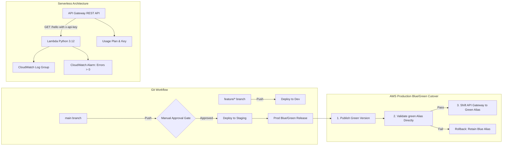
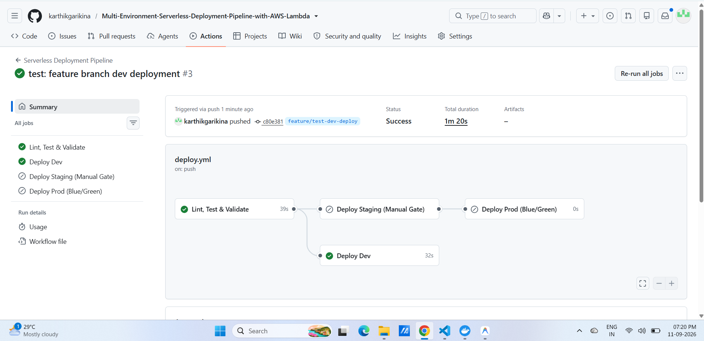
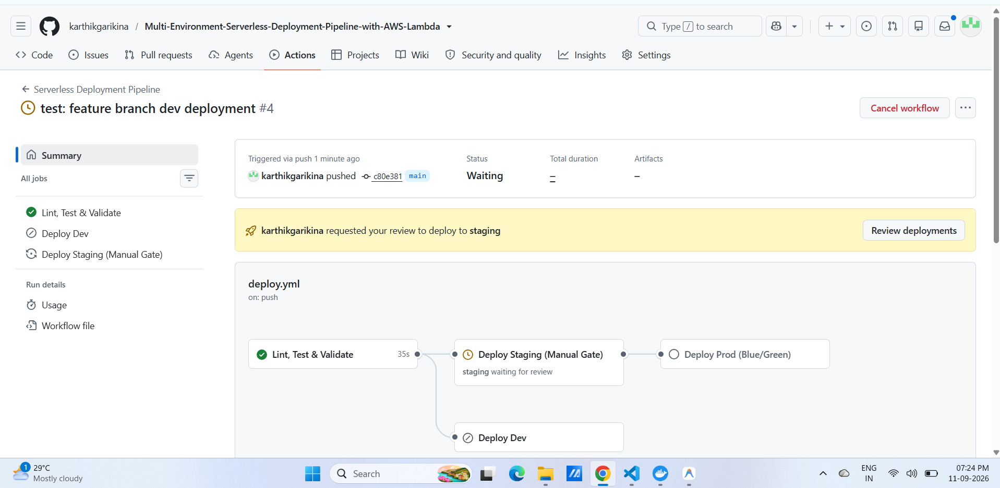
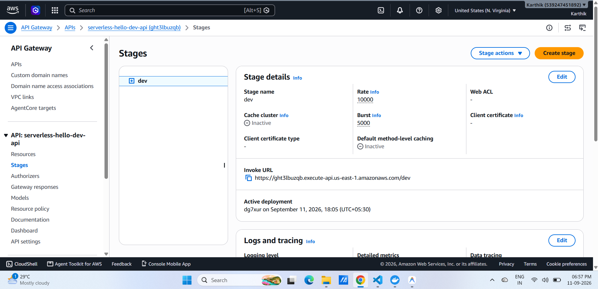
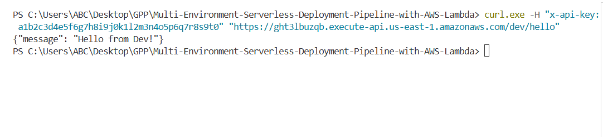
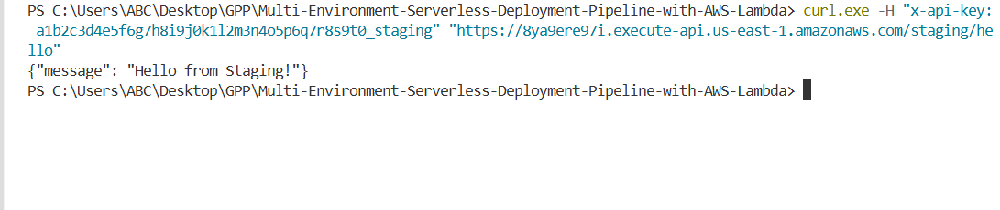
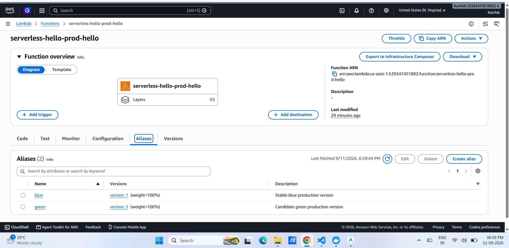
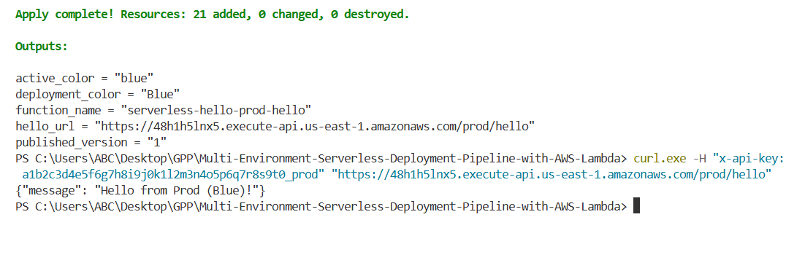
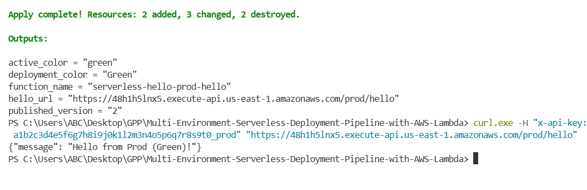
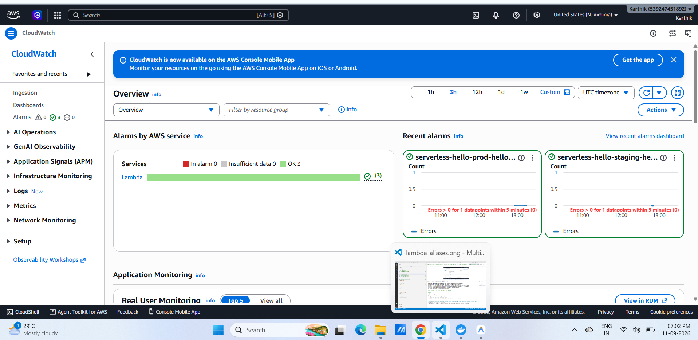

# Multi-Environment Serverless Deployment Pipeline with AWS Lambda

[](https://www.terraform.io)
[](https://aws.amazon.com)
[](https://python.org)
[](https://www.docker.com)
[](https://github.com)

A robust, multi-environment CI/CD delivery pipeline deploying a serverless REST API using AWS Lambda and API Gateway, with infrastructure fully managed by modular Terraform across `dev`, `staging`, and `prod`. Features zero-downtime **Blue/Green production cutover**, automated CloudWatch monitoring and alarms, manual approval gates, and containerized local validation.

---

## System Architecture



---

## Core Capabilities & Architecture

- **Multi-Environment Isolation**: Root configurations (`terraform/environments/{dev,staging,prod}`) deploy identical modular infrastructure into isolated namespaces and remote state keys with DynamoDB locking.
- **Stateless API Design**: Python 3.12 Lambda behind API Gateway (`GET /hello`) with CORS preflight support, least-privilege IAM roles, and environment-aware responses:
  - Dev: `{"message": "Hello from Dev!"}`
  - Staging: `{"message": "Hello from Staging!"}`
  - Prod (Blue): `{"message": "Hello from Prod (Blue)!"}`
  - Prod (Green): `{"message": "Hello from Prod (Green)!"}`
- **Production Zero-Downtime Blue/Green**: Uses immutable Lambda versioning and persistent `blue` and `green` aliases. Candidate green versions are deployed and validated in isolation via AWS CLI before shifting API Gateway traffic.
- **Endpoint Security**: Secured using required `x-api-key` headers associated with API Gateway Usage Plans.
- **Observability & Proactive Monitoring**: CloudWatch log streams (14-day retention) paired with Metric Alarms triggering on `Errors > 0` over 5-minute evaluation periods.
- **CI/CD Automation**: GitHub Actions pipeline automating linting, pytest, Terraform formatting, dev deploys on feature branches, manual approval gates for staging, and production blue/green traffic shifting.

---

## Quick Start & Local Commands

### 1. Run Automated Validation Suite (One Command)
Runs pytest, Terraform formatting checks, and validates all environments inside a hermetic container:
```bash
docker compose run --rm check
```

### 2. Configure Credentials (`.env`)
Copy `.env.example` to `.env` and supply your AWS credentials:
```env
AWS_REGION=us-east-1
AWS_ACCESS_KEY_ID=AKIA...
AWS_SECRET_ACCESS_KEY=...
TF_STATE_BUCKET=your-terraform-state-bucket
TF_LOCK_TABLE=your-terraform-lock-table
PROJECT_OWNER=Karthik
API_KEY_VALUE=a1b2c3d4e5f6g7h8i9j0k1l2m3n4o5p6q7r8s9t0
```

### 3. Deploy Environments
```bash
# Deploy Dev
docker compose run --rm deploy dev

# Deploy Staging
docker compose run --rm deploy staging

# Deploy Prod (Blue)
docker compose run --rm deploy prod

# Shift Prod to Green (Zero-Downtime)
docker compose run --rm deploy prod-green
```

### 4. Verify Endpoints
```bash
# Dev
curl -H "x-api-key: $API_KEY" "<DEV_URL>"
# Response: {"message": "Hello from Dev!"}

# Staging
curl -H "x-api-key: ${API_KEY}_staging" "<STAGING_URL>"
# Response: {"message": "Hello from Staging!"}

# Prod (Initial Blue)
curl -H "x-api-key: ${API_KEY}_prod" "<PROD_URL>"
# Response: {"message": "Hello from Prod (Blue)!"}

# Prod (After Green Shift)
curl -H "x-api-key: ${API_KEY}_prod" "<PROD_URL>"
# Response: {"message": "Hello from Prod (Green)!"}
```

---

## CI/CD Pipeline & GitHub Configuration

### 1. Repository Secrets & Variables
Set in **Settings → Secrets and variables → Actions**:
- **Secrets**: `AWS_ACCESS_KEY_ID`, `AWS_SECRET_ACCESS_KEY`, `TF_STATE_BUCKET`, `TF_LOCK_TABLE`, `API_KEY_VALUE`
- **Variables**: `PROJECT_OWNER`

### 2. Environments & Approval Gate
In **Settings → Environments**:
- Create `dev`, `staging`, and `prod`.
- On **`staging`**, enable **Required reviewers** to enforce the manual sign-off gate before promotion.

### 3. Workflow Triggers
- **Pushes to `feature/**`**: Runs test suite, formatting checks, and applies changes to `dev`.
- **Pushes to `main`**: Runs tests, pauses at the staging approval gate, deploys to `staging`, and executes the automated Blue/Green production cutover.

---

## Verification & Submission Evidence

### Checkpoint 1: Dev Deployment on Feature Branch

*Automated feature branch workflow run showing test execution and successful dev apply.*

---

### Checkpoint 2: Staging Manual Approval Gate

*Pipeline execution paused at the staging manual review gate awaiting explicit approval.*

---

### Checkpoint 3: API Gateway Stages & Security

*API Gateway console displaying active stages, deployment timestamps, and Usage Plan key associations.*

---

### Checkpoint 4: Dev Endpoint Verification

*Dev endpoint returning 200 OK with `{"message": "Hello from Dev!"}`.*

---

### Checkpoint 5: Staging Endpoint Verification

*Staging endpoint returning 200 OK with `{"message": "Hello from Staging!"}`.*

---

### Checkpoint 6: Lambda Aliases (`blue` & `green`)

*AWS Lambda Console showing the published function versions alongside active `blue` and `green` aliases.*

---

### Checkpoint 7: Prod Initial Response (Blue)

*Production endpoint returning `{"message": "Hello from Prod (Blue)!"}`.*

---

### Checkpoint 8: Prod Post-Cutover Response (Green)

*Production endpoint returning `{"message": "Hello from Prod (Green)!"}` after traffic cutover.*

---

### Checkpoint 9: CloudWatch Monitoring & Alarm

*CloudWatch alarm showing OK state and `Errors > 0 for 5 minutes` threshold.*

---

## Demo Video

https://youtu.be/nhJE1IYlqhg

---

## Teardown
```bash
docker compose run --rm deploy make destroy-dev
docker compose run --rm deploy make destroy-staging
docker compose run --rm deploy make destroy-prod
```
