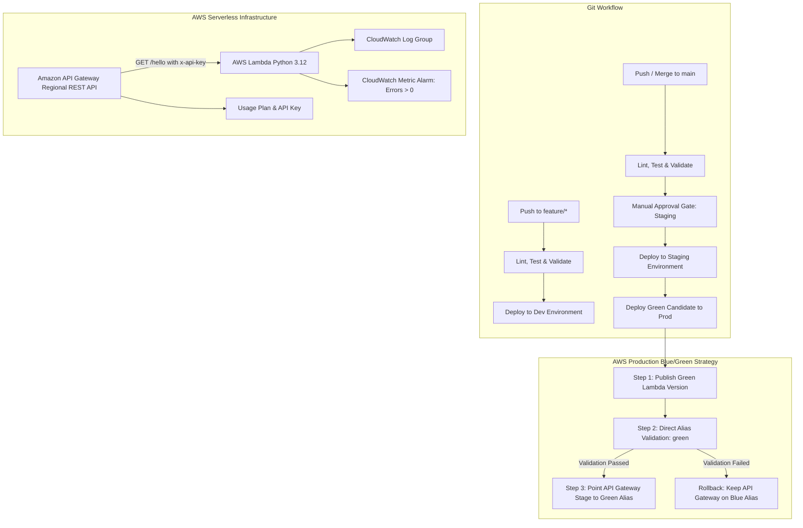

# Multi-Environment Serverless Deployment Pipeline with AWS Lambda & API Gateway

[](https://github.com)
[](https://www.terraform.io)
[](https://aws.amazon.com)
[](https://python.org)
[](https://www.docker.com)

A production-grade, multi-environment CI/CD delivery pipeline for serverless APIs on AWS. Infrastructure is fully codified using modular Terraform across isolated `dev`, `staging`, and `prod` environments, featuring zero-downtime **Blue/Green deployments**, automated CloudWatch monitoring and alerting, manual approval gates, and containerized local validation.

---

## Architecture Overview

The system deploys an isolated serverless API stack for each environment (`dev`, `staging`, `prod`) using reusable Terraform modules. Production utilizes immutable AWS Lambda versioning with persistent `blue` and `green` aliases, allowing candidate deployments to be tested in isolation before API Gateway shifts traffic.



---

## Core Requirements & Implementation Matrix

| Requirement | Implementation Details | Status |
| :--- | :--- | :---: |
| **1. Multi-Environment Structure** | Distinct root directories: `terraform/environments/{dev,staging,prod}` | Verified |
| **2. Dev Environment** | Dedicated Lambda (`python3.12`) + API Gateway Regional REST API (`/hello`) | Verified |
| **3. Dev API Response** | Returns `200 OK` with `{"message": "Hello from Dev!"}` | Verified |
| **4. Staging Environment** | Functionally identical stack isolated in separate state and AWS namespace | Verified |
| **5. Staging API Response** | Returns `200 OK` with `{"message": "Hello from Staging!"}` | Verified |
| **6. Prod Environment** | Separate stack with versioned Lambda and persistent `blue`/`green` aliases | Verified |
| **7. Prod Initial Response** | Returns `200 OK` with `{"message": "Hello from Prod (Blue)!"}` | Verified |
| **8. CI/CD Pipeline** | GitHub Actions workflow (`deploy.yml`) triggered on `main` and `feature/**` | Verified |
| **9. Automated Dev Deployment** | Automatically plans and applies `dev` on pushes to `feature/**` branches | Verified |
| **10. Manual Approval Gate** | GitHub Environment protection rule on `staging` requiring explicit sign-off | Verified |
| **11. Blue/Green Production** | Zero-downtime traffic switching via Lambda aliases & API Gateway stage redeploy | Verified |
| **12. Prod Green Response** | Post-switch endpoint returns `{"message": "Hello from Prod (Green)!"}` | Verified |
| **13. Resource Tagging** | Standard tags across all resources: `Project`, `Environment`, `Owner`, `ManagedBy` | Verified |
| **14. API Gateway Security** | Secured via required `x-api-key` header linked to API Gateway Usage Plans | Verified |
| **15. Observability & Alarms** | CloudWatch log group (14d retention) + Metric Alarm on `Errors > 0` for 5 min | Verified |
| **16. Local Automation** | Makefile + Docker Compose for `check`, `test`, `deploy`, and `destroy` operations | Verified |
| **17. Secret Management** | Credentials passed via CI/CD secrets and environment variables, zero hardcoding | Verified |

---

## Repository Structure

```text
.
├── .github/
│   └── workflows/
│       └── deploy.yml              # GitHub Actions multi-environment CI/CD pipeline
├── docs/
│   └── screenshots/                # Evidence screenshots for submission
│       └── README.md
├── lambda-src/
│   └── hello_function/
│       ├── app.py                  # Python 3.12 Lambda handler (CORS, error handling)
│       └── requirements.txt        # Function dependencies
├── scripts/
│   ├── check.sh                    # Automated test, fmt, and validation runner
│   └── deploy.sh                   # Environment deployment wrapper
├── terraform/
│   ├── environments/
│   │   ├── dev/                    # Dev root module
│   │   │   ├── main.tf
│   │   │   ├── variables.tf
│   │   │   └── outputs.tf
│   │   ├── staging/                # Staging root module
│   │   │   ├── main.tf
│   │   │   ├── variables.tf
│   │   │   └── outputs.tf
│   │   └── prod/                   # Prod root module (Blue/Green aliases)
│   │       ├── main.tf
│   │       ├── variables.tf
│   │       └── outputs.tf
│   └── modules/
│       ├── api-gateway/            # Reusable API Gateway, API Key, Usage Plan & CORS module
│       │   ├── main.tf
│       │   ├── variables.tf
│       │   └── outputs.tf
│       └── lambda/                 # Reusable Lambda, IAM, CloudWatch logs & alarm module
│           ├── main.tf
│           ├── variables.tf
│           └── outputs.tf
├── tests/
│   └── test_app.py                 # Pytest test suite covering all environments & failure modes
├── .env.example                    # Template for required environment variables & credentials
├── .gitignore                      # Ignores .env, tfstate, terraform artifacts, caches
├── docker-compose.yml              # Containerized test, check, and deployment services
├── Dockerfile                      # Hermetic build container (Python 3.12, Terraform 1.9.8, AWS CLI)
├── Makefile                        # Local commands for init, plan, apply, test, destroy
├── README.md                       # Comprehensive documentation
└── requirements-dev.txt            # Dev & test dependencies (pytest)
```

---

## Architectural & Technical Decisions

### 1. Stateless Serverless API Design
The Lambda function (`lambda-src/hello_function/app.py`) is designed as a stateless request handler behind API Gateway:
- **Environment & Version Awareness**: Reads `ENVIRONMENT` and `VERSION` to generate standard greetings:
  - Dev: `{"message": "Hello from Dev!"}`
  - Staging: `{"message": "Hello from Staging!"}`
  - Prod Blue: `{"message": "Hello from Prod (Blue)!"}`
  - Prod Green: `{"message": "Hello from Prod (Green)!"}`
- **CORS Support**: Returns `Access-Control-Allow-Origin: *` and `Access-Control-Allow-Methods: GET,OPTIONS` headers.
- **Defensive Error Handling**: Catches unhandled exceptions gracefully, returning a structured `500 Internal server error` while logging full stack traces to CloudWatch.

### 2. Infrastructure as Code (Terraform Modular Design)
- **Modularity**: Reusable `lambda` and `api-gateway` modules encapsulate resource definitions, least-privilege IAM policies, and CloudWatch log groups.
- **Environment Isolation**: Separate root directories (`dev`, `staging`, `prod`) prevent blast-radius crossover.
- **Remote State Management**: Backend S3 storage with DynamoDB state locking (`backend "s3" {}`), configured dynamically during initialization via `-backend-config`.

### 3. API Gateway Security & CORS
- Configured as a **Regional REST API** with `GET /hello`.
- **API Key Required**: Requests without a valid `x-api-key` header return `403 Forbidden`.
- **Usage Plan Association**: Links the API key to the environment's stage with default quotas.
- **CORS Preflight**: An `OPTIONS` mock integration handles preflight checks cleanly.

### 4. Zero-Downtime Blue/Green Deployment Strategy (Prod)
Production utilizes immutable Lambda versioning and two permanent aliases:
1. **Initial State**: API Gateway invokes `serverless-hello-prod-hello:blue`.
2. **Step 1 (Candidate Publish)**: CI/CD publishes a new Lambda version with `deployment_color=Green` and updates the `green` alias to point to the new version.
3. **Step 2 (Isolated Validation)**: The pipeline directly executes `aws lambda invoke ... --qualifier green` to test the green alias before customer traffic touches it.
4. **Step 3 (Zero-Downtime Cutover)**: The pipeline updates Terraform with `active_color=green`, pointing API Gateway to the green alias.
5. **Instant Rollback**: If validation fails, traffic never leaves `blue`. Reverting takes a single command (`-var='active_color=blue'`).

---

## Quick Start & Local Execution

### Prerequisites
- [Docker Desktop](https://www.docker.com/products/docker-desktop/) installed and running.
- (Optional for non-Docker commands) [AWS CLI v2](https://aws.amazon.com/cli/) and [Terraform >= 1.6](https://www.terraform.io/).

---

### Step 1: Run the Hermetic Docker Check (One Command)
Verify the entire codebase, all unit tests, Terraform formatting, and environment configurations:

```bash
docker compose run --rm check
```

Output:
```text
tests/test_app.py::test_dev_environment PASSED                           [ 20%]
tests/test_app.py::test_staging_environment PASSED                       [ 40%]
tests/test_app.py::test_prod_blue_environment PASSED                     [ 60%]
tests/test_app.py::test_prod_green_environment PASSED                    [ 80%]
tests/test_app.py::test_error_handling PASSED                            [100%]
5 passed in 0.03s

Success! The configuration is valid. (dev)
Success! The configuration is valid. (staging)
Success! The configuration is valid. (prod)

All checks passed.
```

To run only the unit test suite:
```bash
docker compose run --rm test
```

---

### Step 2: Configure Environment Credentials
Copy `.env.example` to `.env` (it is git-ignored):

```bash
cp .env.example .env
```

Edit `.env` and fill in your actual AWS credentials and backend values:

```env
AWS_REGION=us-east-1
AWS_ACCESS_KEY_ID=AKIA...
AWS_SECRET_ACCESS_KEY=...
TF_STATE_BUCKET=my-terraform-state-bucket
TF_LOCK_TABLE=my-terraform-lock-table
PROJECT_OWNER=cloud-team
API_KEY_VALUE=a-secure-random-32-char-api-key-here
```

> [!TIP]
> **Bootstrap Remote State**: If you haven't created the S3 bucket and DynamoDB lock table yet, run:
> ```bash
> aws s3api create-bucket --bucket my-terraform-state-bucket --region us-east-1
> aws dynamodb create-table --table-name my-terraform-lock-table \
>   --attribute-definitions AttributeName=LockID,AttributeType=S \
>   --key-schema AttributeName=LockID,KeyType=HASH \
>   --billing-mode PAY_PER_REQUEST --region us-east-1
> ```

---

### Step 3: Deploy via Docker Compose (or Makefile)

Deploy any environment with a single Docker command:

```bash
# Deploy Dev
docker compose run --rm deploy dev

# Deploy Staging
docker compose run --rm deploy staging

# Deploy Prod (Blue)
docker compose run --rm deploy prod

# Deploy Prod (Green)
docker compose run --rm deploy prod-green
```

Or using the `Makefile` directly (if Terraform and AWS CLI are locally available):

```bash
make dev
make staging
make prod
make prod-green
```

---

### Step 4: Verify the Endpoints with `curl`

Fetch the deployed API URL from Terraform output:

```bash
# For Dev:
DEV_URL=$(docker compose run --rm deploy sh -c "terraform -chdir=terraform/environments/dev output -raw hello_url")
curl -H "x-api-key: your-api-key-value" "$DEV_URL"
# Response: {"message": "Hello from Dev!"}

# For Staging:
STAGING_URL=$(docker compose run --rm deploy sh -c "terraform -chdir=terraform/environments/staging output -raw hello_url")
curl -H "x-api-key: your-api-key-value" "$STAGING_URL"
# Response: {"message": "Hello from Staging!"}

# For Prod (Initial / Blue):
PROD_URL=$(docker compose run --rm deploy sh -c "terraform -chdir=terraform/environments/prod output -raw hello_url")
curl -H "x-api-key: your-api-key-value" "$PROD_URL"
# Response: {"message": "Hello from Prod (Blue)!"}

# For Prod (After Green Shift):
curl -H "x-api-key: your-api-key-value" "$PROD_URL"
# Response: {"message": "Hello from Prod (Green)!"}
```

---

## CI/CD Pipeline & GitHub Actions Setup

### 1. Configure GitHub Secrets and Variables
In your GitHub repository, navigate to **Settings → Secrets and variables → Actions** and add:

#### Repository Secrets:
| Secret Name | Description |
| :--- | :--- |
| `AWS_ACCESS_KEY_ID` | IAM deployment user Access Key ID |
| `AWS_SECRET_ACCESS_KEY` | IAM deployment user Secret Access Key |
| `TF_STATE_BUCKET` | S3 bucket for Terraform remote state |
| `TF_LOCK_TABLE` | DynamoDB table for Terraform state locking |
| `API_KEY_VALUE` | Secure API key for API Gateway authentication |

#### Repository Variables:
| Variable Name | Description |
| :--- | :--- |
| `PROJECT_OWNER` | Team or user tag (e.g. `devops-team`) |

### 2. Configure GitHub Environments & Approval Gate
Navigate to **Settings → Environments**:
1. Create environment: **`dev`** (no review restrictions).
2. Create environment: **`staging`**:
   - Check **Required reviewers** and assign your GitHub user.
   - This enforces the **manual approval gate** before deploying to staging!
3. Create environment: **`prod`** (optional: add required reviewers or protection rules).

### 3. Workflow Trigger Flows
- **Push to `feature/**`**: Runs test suite, Terraform format check, and automatically plans & applies to the `dev` environment.
- **Push to `main`**: Runs test suite, pauses at the **staging manual approval gate**, deploys `staging`, and executes the **Blue/Green production cutover** with zero downtime.

---

## Evidence & Screenshot Checkpoints

Below are the dedicated placeholders for your submission evidence. Replace each placeholder image with your actual screenshots located in `docs/screenshots/`:

### Checkpoint 1: CI/CD Pipeline Run — Dev Deployment on Feature Branch

*Shows automated trigger on `feature/*`, test execution, Terraform formatting check, and successful dev apply.*

---

### Checkpoint 2: Staging Manual Approval Gate in GitHub Actions

*Shows the pipeline paused at the `staging` environment gate awaiting reviewer approval before applying.*

---

### Checkpoint 3: AWS API Gateway Stages & Usage Plans

*Shows API Gateway REST API console with `dev`, `staging`, and `prod` stages, API keys, and associated Usage Plans.*

---

### Checkpoint 4: Dev Endpoint Verification

*Terminal showing `curl -H "x-api-key: ..." <dev_url>` returning `200 OK` with `{"message": "Hello from Dev!"}`.*

---

### Checkpoint 5: Staging Endpoint Verification

*Terminal showing `curl -H "x-api-key: ..." <staging_url>` returning `200 OK` with `{"message": "Hello from Staging!"}`.*

---

### Checkpoint 6: AWS Lambda Aliases (`blue` & `green`)

*AWS Lambda Console showing the deployed function versions alongside active `blue` and `green` aliases.*

---

### Checkpoint 7: Prod Endpoint Before Traffic Shift (Blue)

*Terminal showing prod endpoint returning `{"message": "Hello from Prod (Blue)!"}`.*

---

### Checkpoint 8: Green Alias Validation & Prod Traffic Shift (Green)

*Terminal or GitHub Actions log showing isolated validation of the `green` alias, followed by prod traffic shift returning `{"message": "Hello from Prod (Green)!"}`.*

---

### Checkpoint 9: AWS CloudWatch Log Groups & Metric Alarm

*AWS CloudWatch console showing `/aws/lambda/serverless-hello-...` log streams and the `serverless-hello-...-errors` metric alarm (Errors > 0).*

---

## Tear Down & Resource Destruction

To avoid unwanted AWS charges when evaluation is complete, destroy all provisioned resources:

```bash
# Destroy individual environments via Docker
docker compose run --rm deploy make destroy-dev
docker compose run --rm deploy make destroy-staging
docker compose run --rm deploy make destroy-prod

# Or destroy all via Makefile locally
make clean
```
